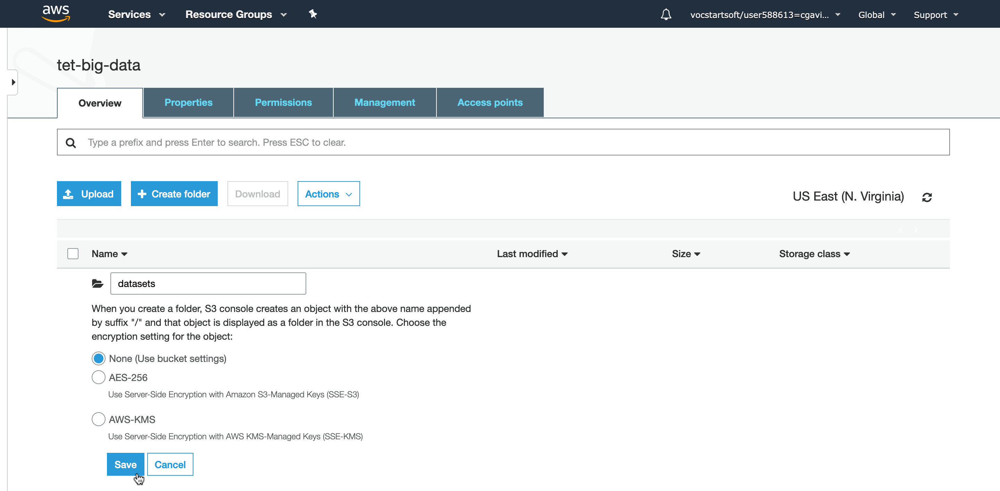
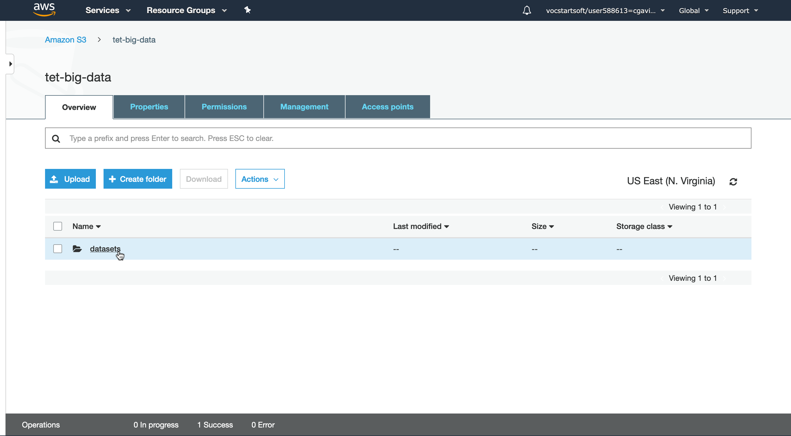
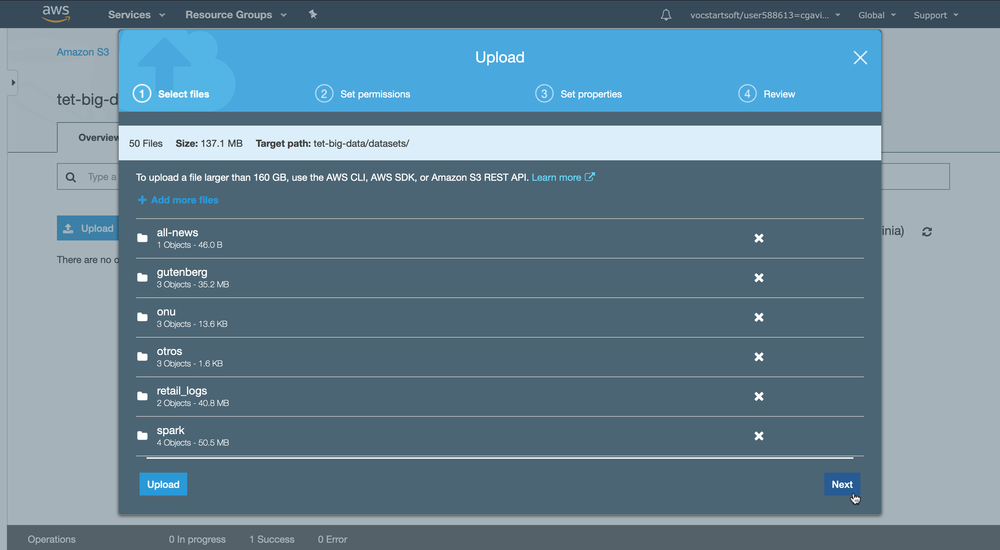
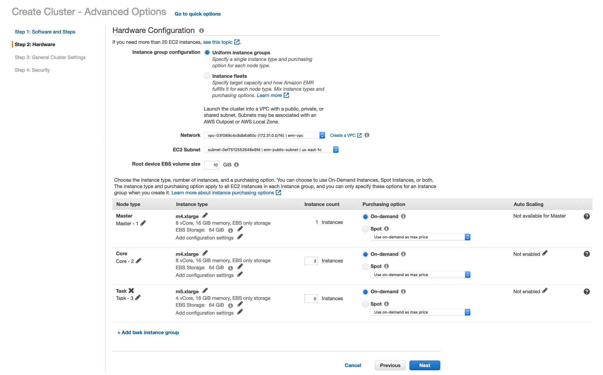

# Bitácora

## 1. Laboratorio HDFS

### 1.1. DCA

1. Se ingresa por la terminal al DCA utilizando la VPN. 
2. Creación del directorio _datasets_ en el HDFS en la ruta `/user/cgavir29/`. 
3. Clonación del repositorio [st0264eafit/bigdata](https://github.com/st0263eafit/bigdata) que contiene los _datasets_ en `/home/cgavir29`. 
4. Se toma la carpeta _datasets_ y se extraen los `.zip` que allí se encuentran. 
5. Se copia el directorio local `/home/cgavir29/datasets` al directorio HDFS `/user/cgavir29/datasets`. 

### 1.2. S3

1. Vamos al servicio de S3 y presionamos el botón _Create bucket_. 
2. Ponemos un nombre al bucket, nos aseguramos que _Block all public access_ no esté activado y damos en _Create bucket_. 
3. Ahora creamos una carpeta que se llamará `datasets`.  
4. Finalmente damos acceso público al directorio creado   y pasamos a cargar los datos.
5. Primero clonamos el repositorio con los comandos que se ven en pantalla. Después, en S3 entramos a la carpeta _datasets_ y damos click en _upload_. Arrastramos los archivos que clonamos del repositorio y seguimos las configuraciones como se indica.      

## 2. EMR

### 2.1. Pre-Creación

1. Antes de empezar es importante conocer el dashboard en el cual estaremos trabajando. 
2. Vamos a _Your VPCs_ y creamos una VPC donde haremos todas las configuraciones necesarias para el correcto funcionamiento del cluster EMR. 
3. En la sección _Internet Gateway_ creamos una Internet Gateway (IG) para nuestra VPC. 
4. Para agregar la IG damos click en _Attach to VPC_. 
5. Después vamos a Route Tables, seleccionamos la que tiene en _VPC ID_ el código correspondiente a la creada en el paso uno y le asignamos un nombre. 
6. Damos click en el botón de abajo _Routes_ y aparecerá un botón que dice _Edit routes_, damos click en éste y añadimos la siguiente configuración. 
7. Vamos a la parte de _Subnets_ y damos click en _Create subnet_. Nos encontraremos con la siguiente pantalla, seleccionamos la VPC creada y llenamos los campos necesarios. 
8. Finalmente es hora de habilitar el _DNS Hostname_ y para ello vamos a _Your VPCs_, seleccionamos la VPC creada y en _Actions_ damos click en _Edit DNS hostnames_.  Nos mostrará la siguiente vista, damos click en el campo _enable_ y después en guardar. 

### 2.2. Creación

1. Vamos al servicio EMR de Amazon.  y damos click en el botón azul _Create cluster_ y nos encontraremos con la siguiente información.
2. Después del paso anterior nos encontraremos con lo siguente.  Para configurar adecuadamente nuestro cluster iremos a las opciones avanzadas presionando el link en donde se encuentra el puntero en la imagen anterior.
3. Ahora seleccionamos lo servicios que queremos que tenga nuestro cluster como se ve en la siguiente imagen.  y damos click en _Next_ en la esquina inferior derecha.
4. En esta sección indicamos la VPC que vamos a utilizar para nuestro cluster, así como la subnet y el tipo de instancias que utlizaremos para el _Master_ y el _Core_.  igual que en el paso anterior presionamos _Next_ en la esquina inferior derecha.
5. Indicamos el nombre el cluster EMR que vamos a crear.  y presionamos el botón _Next_.
6. En este paso seleccionamos la _EC2 key pair_ que usaremos para acceder a nustro cluster.  y presionamos el botón _Create cluster_.
7. Cuando veamos la siguiente información nuestro cluster (tet-emr) se habrá creado satisfactoriamente. 
8. Aún no hemos terminado, debemos consigurar los puertos en el grupo de seguridad para asegurar que se tiene acceso a los diferentes servicios del cluster. Para damos click en el nombre del cluster en la imagen anterior y vamos al link que está subrayado en la siguiente imagen. 
9. Seleccionamos el que corresponde al master.  y asignamos los permisos correspondientes. 

### 2.3. Destrucción

1. Para destruir nuestro cluster simplemente seleccionamos nuestro cluster damos click en el botón _Terminate_.  nuestro cluster dejará de estar activo pero no desaparecerá. 

### 2.4. Clonación

1. Para recrear un cluster igual al que se creó anterioemente seleccionamos nuestro cluster y vamos click en el botón _Clone_. 
2. Aparecerá el siguiente pop-up para preguntarnos si deseamos cambiar la configuración o simplemente crear un nuevo cluster. 
3. También podemos recrear (clonar) un cluster con el CLI de AWS y para ello hacemos lo siguiente. Seleccionamos el cluster que queremos clonar y presionamos en _View details_.  Una vez allí damos click en _AWS CLI export_.  Finalmente copiamos el comando que aparece en pantalla. 

### 2.5. Acceso SSH

1. Vamos a los detalles de nuestro cluster, damos click en donde está el mouse y copiamos el comando que aparece subrayado. 
2. Pegamos el comando en la terminal y ya podemos acceder al cluster, cabe recordar que se debe tener la llave de acceso. También podemos ver que los comandos de HDFS funcionan sin ningún problema.

### 2.6. Acceso HUE

1. Vamos a los detalles del cluster y copiamos la dirección que parace subrayada. 
2. Ahora vamos a un buscador e ingresamos esa dirección poniendo al final `:8888` y veremos la siguiente vista.  Si es la primera vez, debe crear una cuenta siguiendo las instrucciones que allí aparecerán.
3. Una vez adentro podemos ver nuestros buckets de S3 siguiendo estos pasos:    
4. También podemos acceder desde HUE al HDFS, así:  

## 3. WordCount y MapReduce - LOCAL

Ingresamos a la carpeta `02-mapreduce` dentro del repositorio [bigdata](https://github.com/st0263eafit/bigdata). Corremos el `wordcount-local.py`  y después el `wordcount-mr.py` en modo local. 

## 4. WordCount y MapReduce - HADOOP

## 5. WordCount y MapReduce - EMR

### 5.1. Datos S3

### 5.2. Datos HDFS

## 6. Ejercicio Seleccionado

Se escogió el ejercicio 1, el código se encuentra en [empleados.py](./empleados.py)
