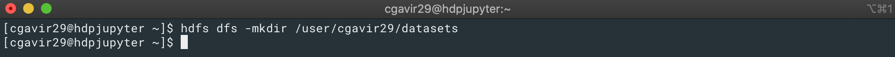
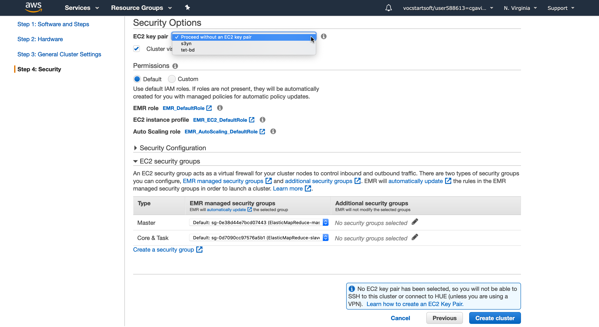
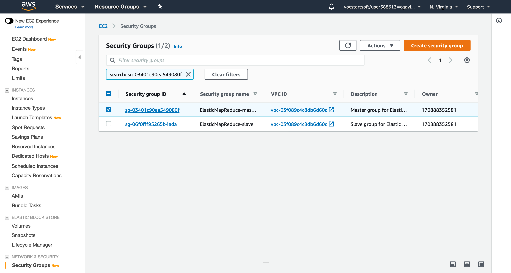

# Bitácora

## Laboratorio HDFS

### DCA

1. Se ingresa por la terminal al DCA utilizando la VPN. 
2. Creación del directorio _datasets_ en el HDFS en la ruta `/user/cgavir29/`. 
3. Clonación del repositorio https://github.com/st0263eafit/bigdata que contiene los _datasets_ en `/home/cgavir29`. 
4. Se toma la carpeta _datasets_ y se extraen los `.zip` que allí se encuentran. 
5. Se copia el directorio local `/home/cgavir29/datasets` al directorio HDFS `/user/cgavir29/datasets`. 

### Amazon S3

## EMR

### Pre-Creación

1. Antes de empezar es importante conocer el dashboard en el cual estaremos trabajando. 
2. Vamos a _Your VPCs_ y creamos una VPC donde haremos todas las configuraciones necesarias para el correcto funcionamiento del cluster EMR. 
3. En la sección _Internet Gateway_ creamos una Internet Gateway (IG) para nuestra VPC. 
4. Para agregar la IG damos click en _Attach to VPC_. 
5. Después vamos a Route Tables, seleccionamos la que tiene en _VPC ID_ el código correspondiente a la creada en el paso uno y le asignamos un nombre. 
6. Damos click en el botón de abajo _Routes_ y aparecerá un botón que dice _Edit routes_ damos click en este y añadimos la siguiente configuración. 
7. Vamos a la parte de _Subnets_ y damos click en _Create subnet_. Nos encontraremos con la siguiente pantalla, seleccionamos la VPC creada y llenamos los campos necesarios. 
8. Finalmente es hora de habilitar el _DNS Hostname_ y para ello vamos a _Your VPCs_, seleccionamos la VPC creada y en _Actions_ damos click en _Edit DNS hostnames_. 
Nos mostrará la siguiente vista, damos click en el cambo _enable_ y después en guardar. 

### Creación

### Destrucción

### Clonación
