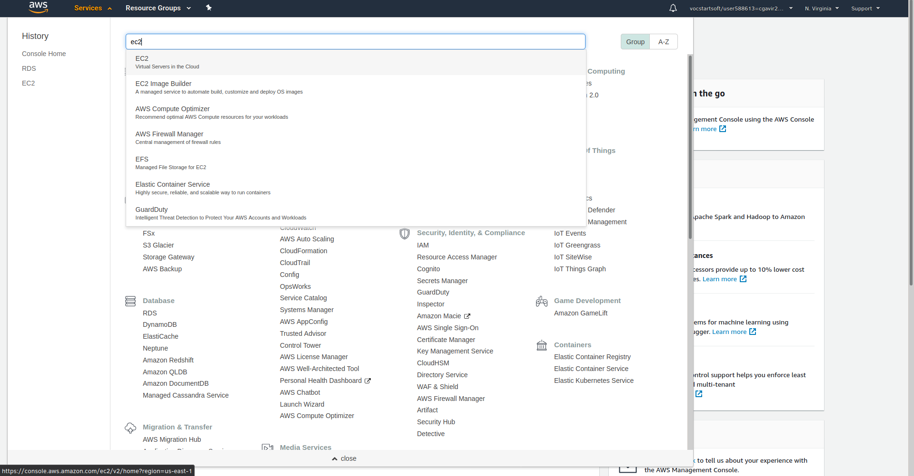
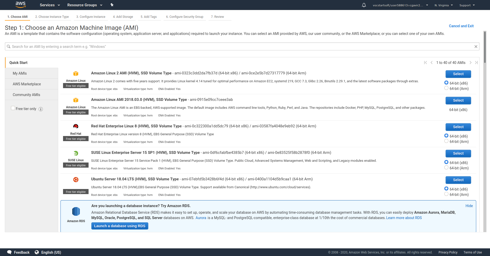
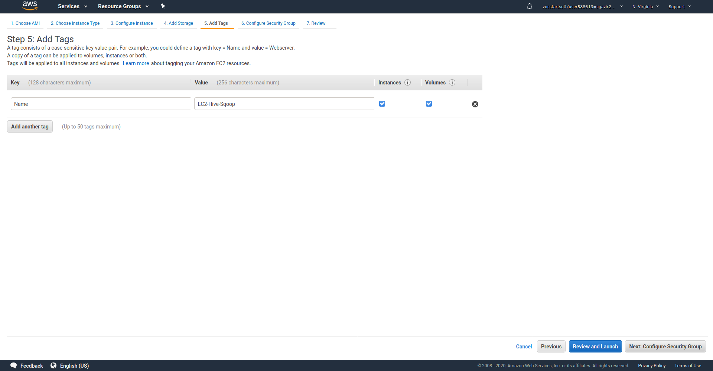
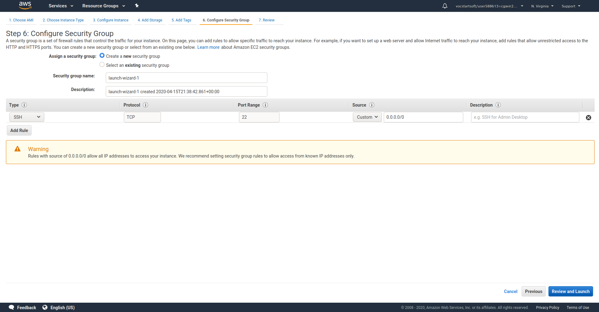
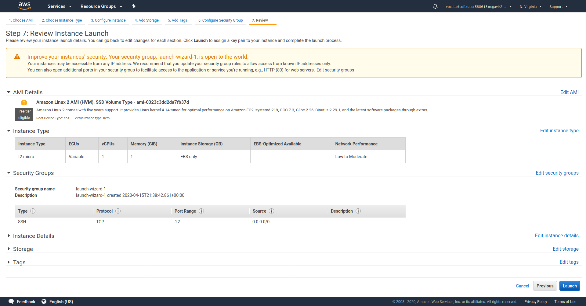
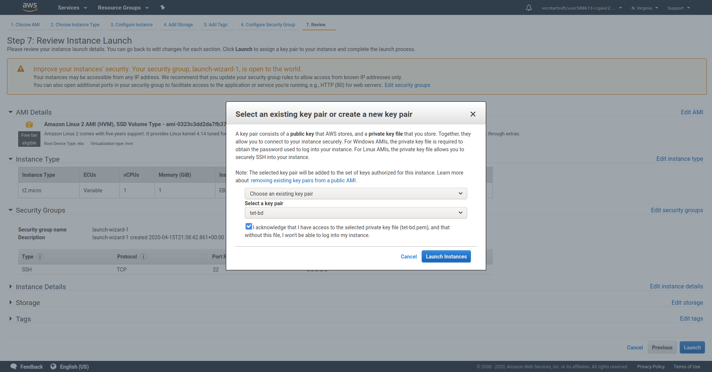
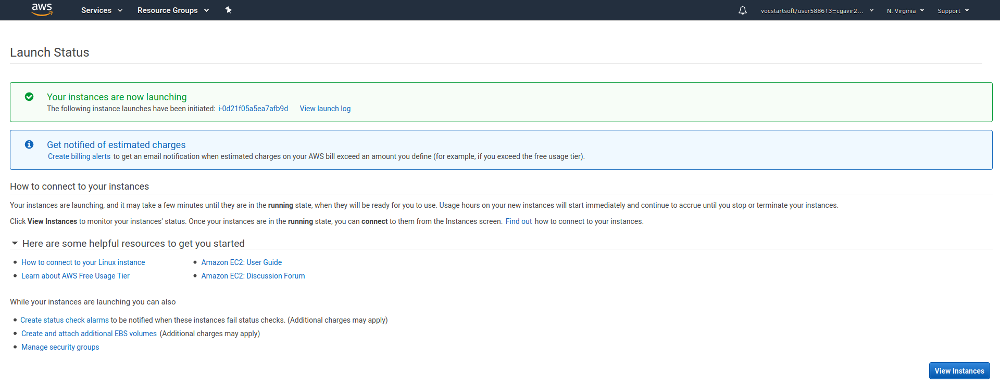

# Creación de Instancia EC2

1. Buscamos el servicio EC2 en AWS  y damos click en EC2.
2. Una vez en EC2 presionamos el botón _Launch instance_. 
3. Seleccionamos la primera opción _Amazon Linux 2 AMI_ y damos click en _Select_. 
4. Es hora de configurar la máquina que vamos a crear, para ello ponemos las configuraciones como se ve en las imágenes y damos click en _Next: ..._ cada vez.  El nombre e identificador de _Network_ puede cambiar.   Asigne el nombre que desee a la instancia.  Presionamos _Review and Launch_.  Damos click en _Launch_.  Ahora debemos seleccionar la llave con la cual se accederá a la instancia y finalmente lanzamos la creación.  Podemos precionar _View instances_ para ver el estado de nuestra máquina.  
