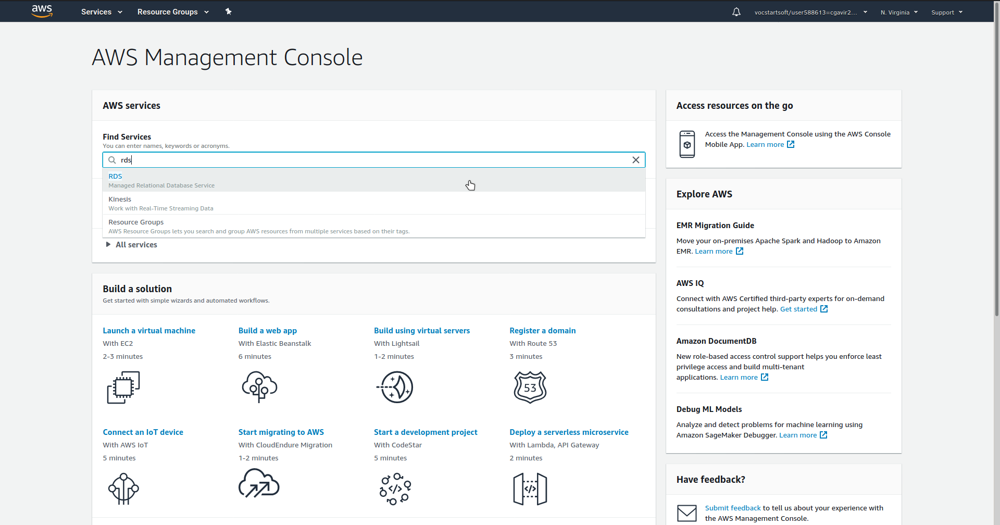
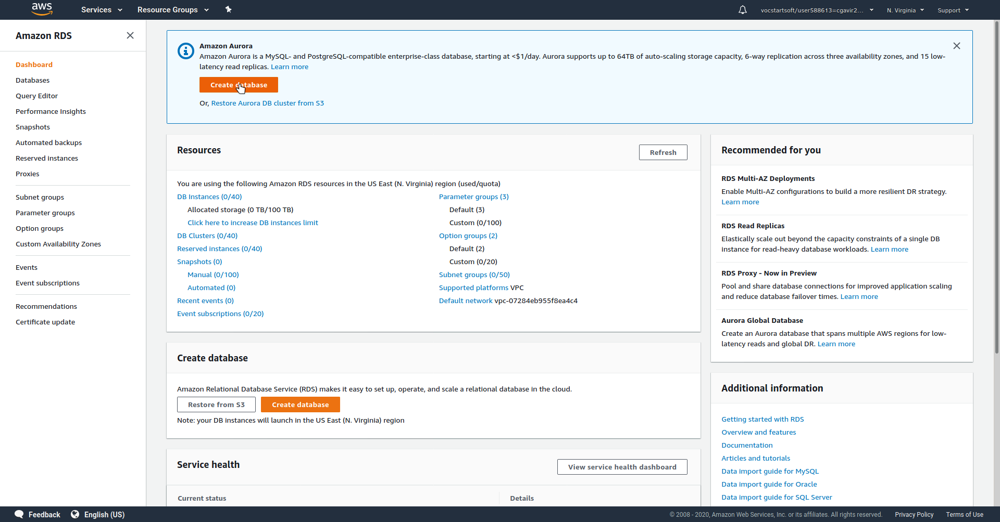
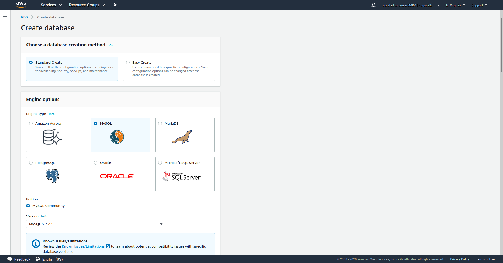
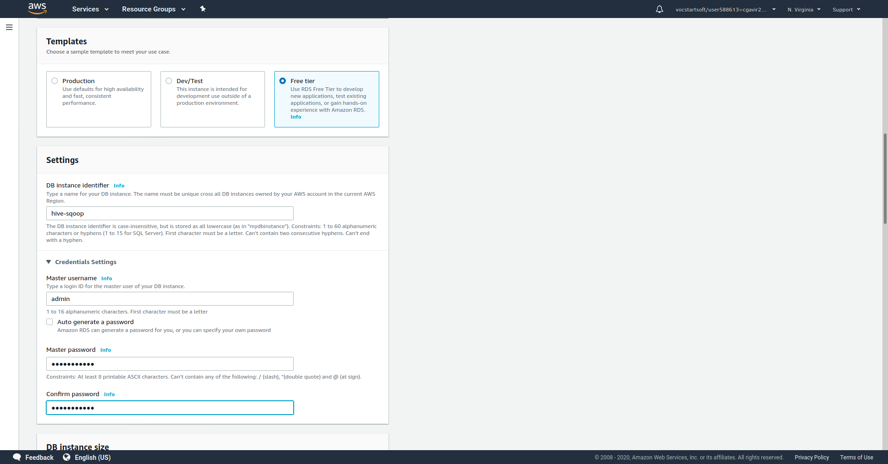
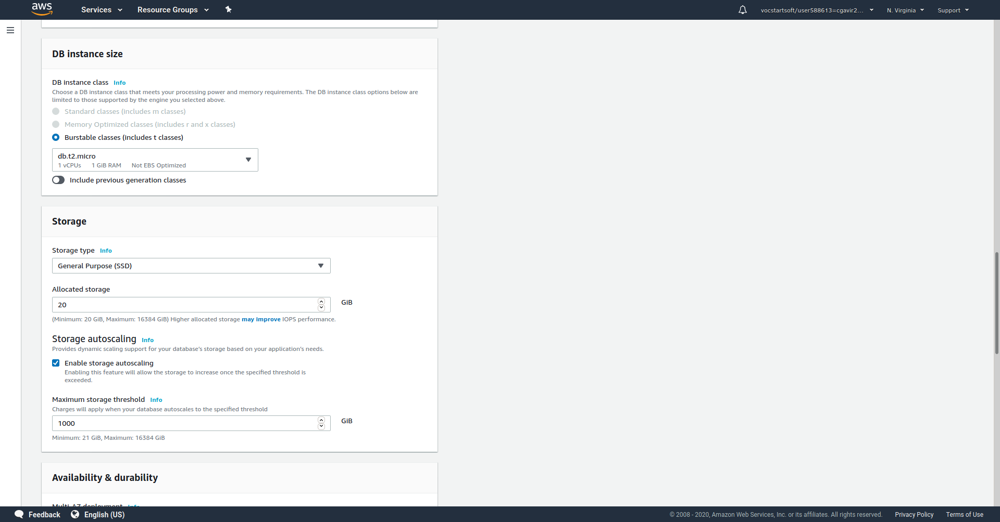
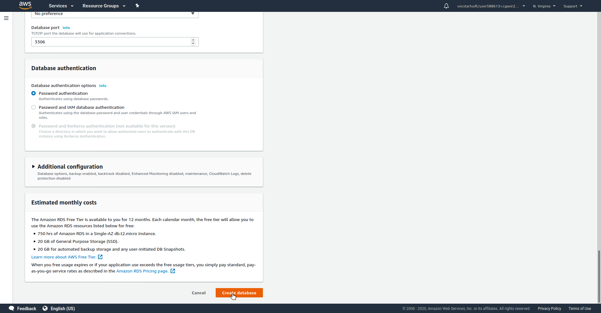
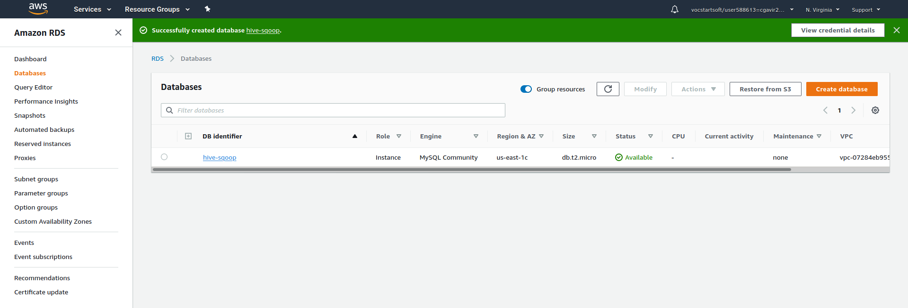

# Creación de Base de Datos MySQL en RDS

1. Buscamos el servicio RDS en AWS  y damos click en RDS.
2. Una vez en RDS presionamos el botón _Create database_. 
3. Seguimos el proceso de creacion como se observa en las siguientes imagenes      Finalmente damos click en _Create database_  y en unos momentos veremos nuestr base de datos creada con estado `Available`
