# Laboratorio Hive & Sqoop

## 1. Conexión Hive via Hue

1. Vamos a los detalles del cluster y copiamos la dirección que parace subrayada. 
2. Ahora, en un buscador ingresamos esa dirección poniendo al final `:8888` y veremos la siguiente vista.  Si es la primera vez, debe crear una cuenta siguiendo las instrucciones que allí aparecerán.

## 2. Archivos de Trabajo

1. Vamos a la sección de _Files_ como se observa en la siguiente imagen. 
2. Una vez allí nos aseguramos de tener los siguientes archivos con los que trabajaremos más adelante. 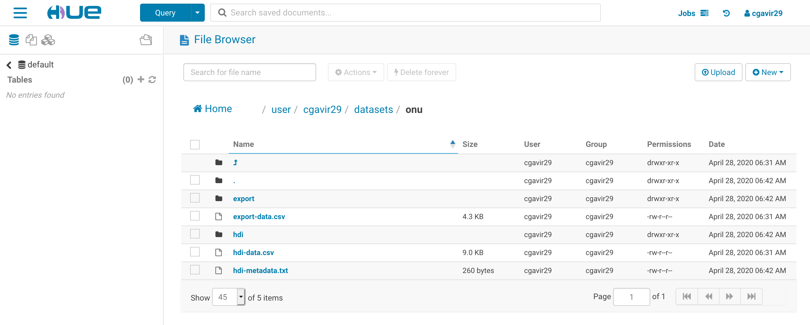

## 3. Gestión (DDL) y Consultas (DQL)

En el menú desplegable de la esquina superior izquierda damos click en la opción _Tables_ y ejecutamos los siguientes comandos de gestión y consulta como se ve en las imágenes. Es importante tener en cuenta que se asume se tienen los _datasets_ en S3.

1. Creamos una base de datos. 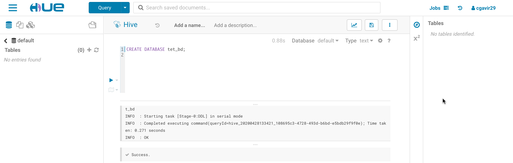
2. Creamos la tabla _hdi_ 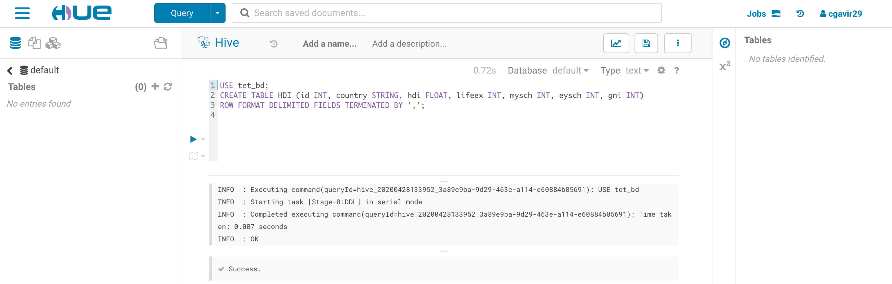 y extraemos los datos correspondientes desde S3. 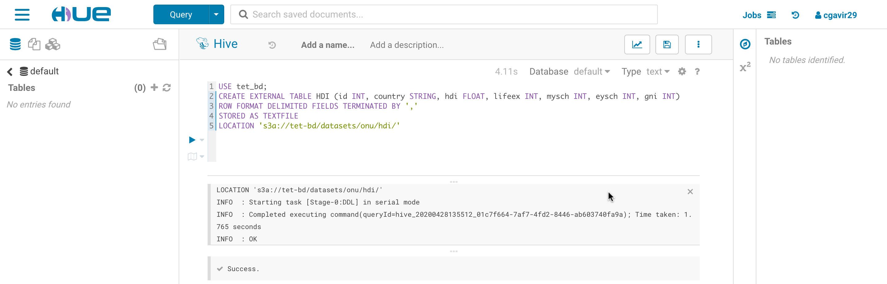
3. Hacemos verificaciones y consultas. 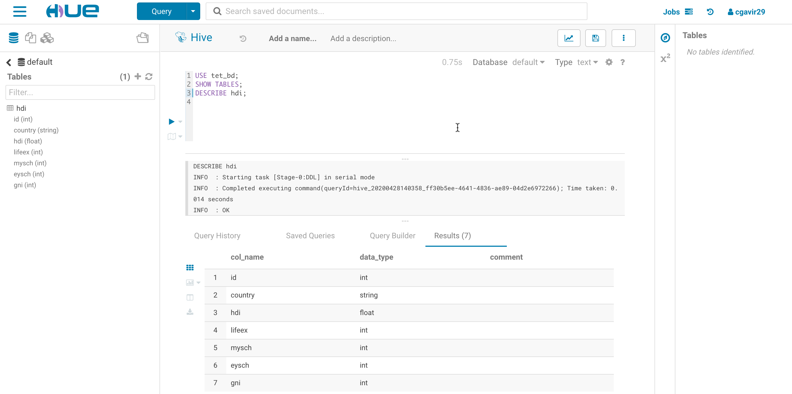  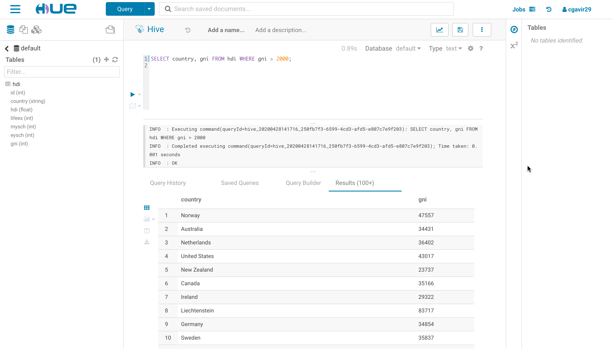
4. Creamos una tabla _expo_ enlazando a S3 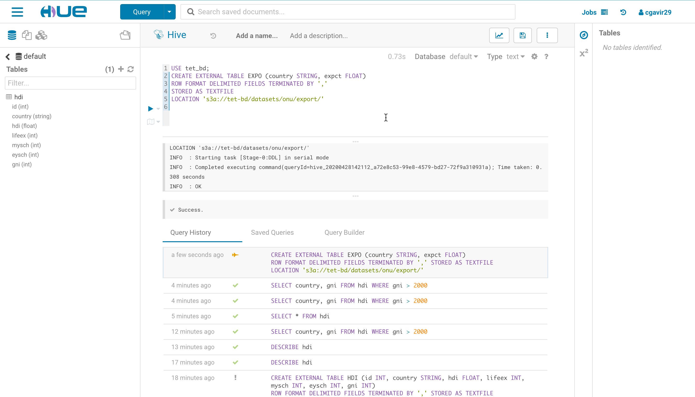 y realizamos consultas. 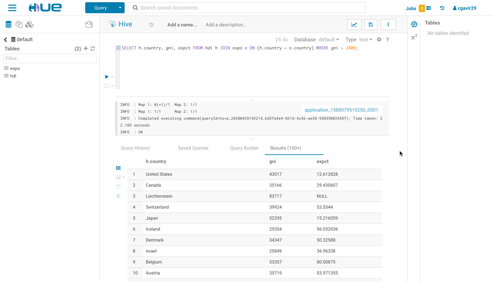

## 4. WordCount - Hive

1. Creamos una tabla que apunte a los archivos en S3 que vamos a utilizar. 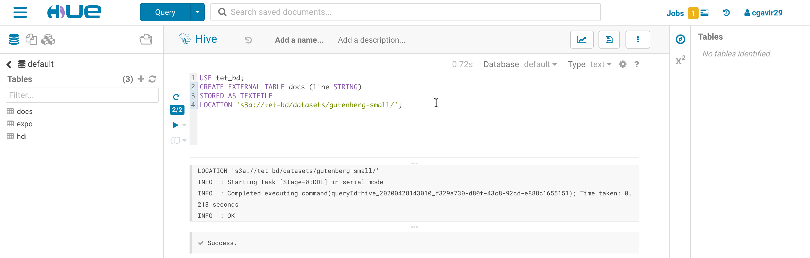
2. Corremos el comando para contar ordenando por palabra. 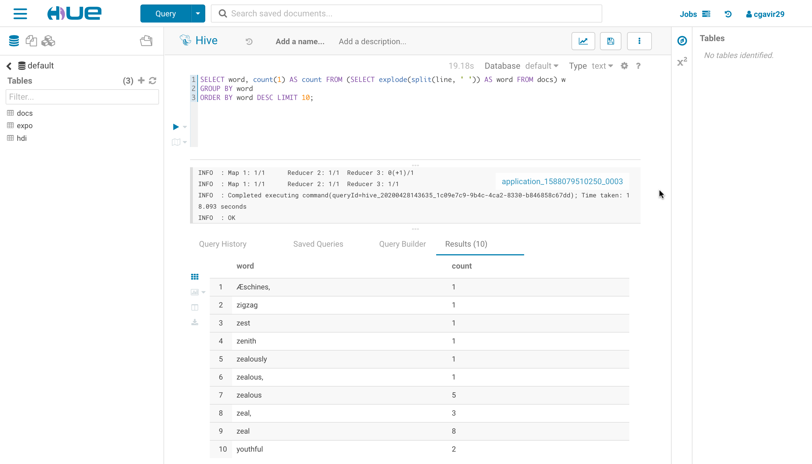
3. Corremos el comando una vez más haciendo las modificaciones para ordenar por frecuencia de mayor a menor. 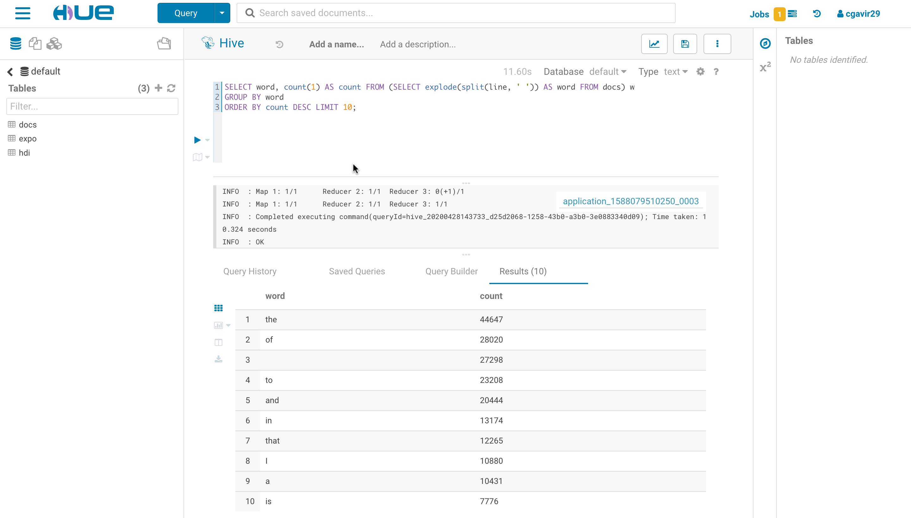

### 4.1. Reto

1. Creamos una tabla _results_ en donde se almacenarán los resultados. 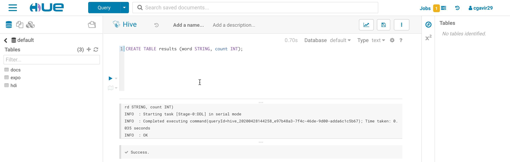
2. Corremos el comando insertando en ésta. 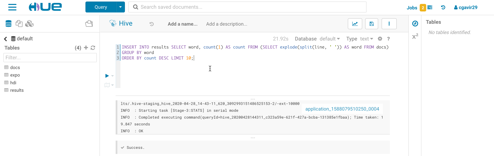
3. Finalemente comprobamos que se hayan guardado los datos. 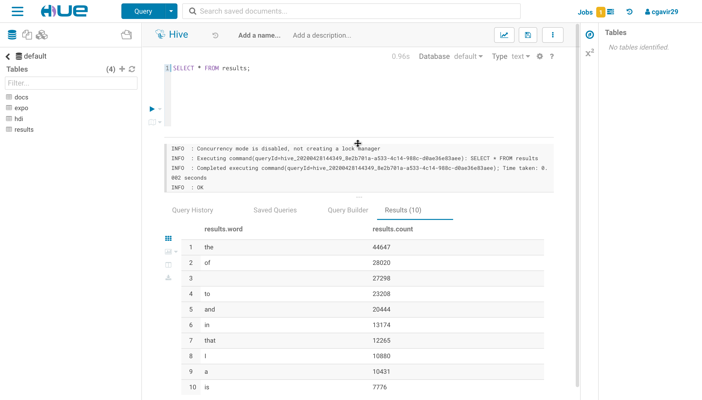

## 5. Apache Sqoop

## 6. MySQL vs Hive
