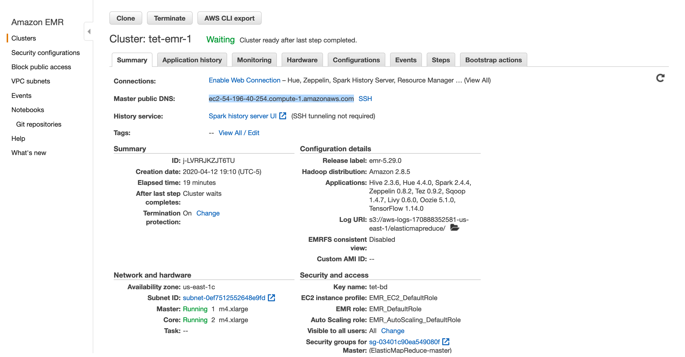
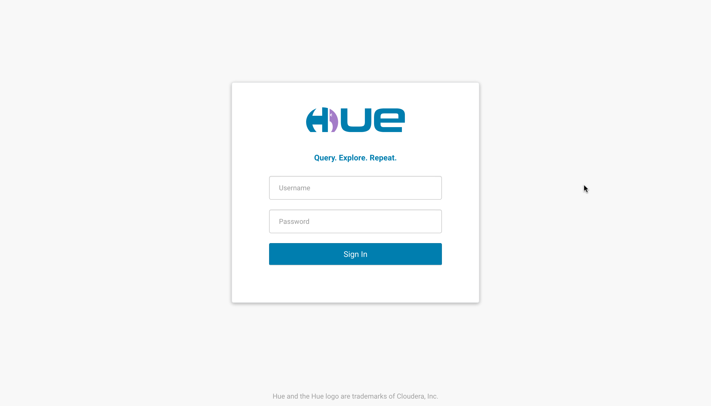
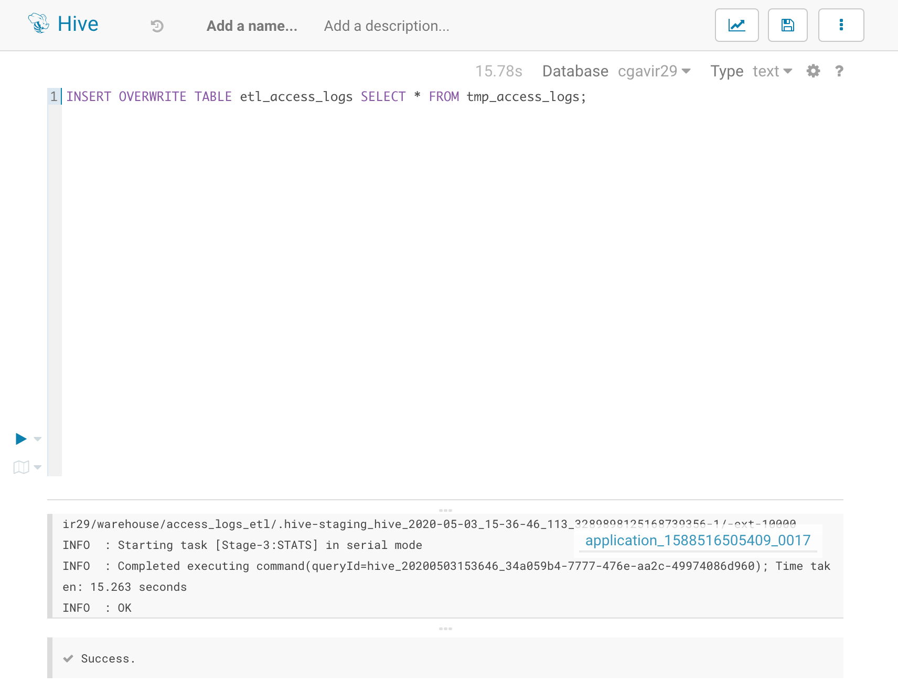

# Laboratorio Hive & Sqoop

## 1. Conexión Hive via Hue

1. Vamos a los detalles del cluster y copiamos la dirección que parace subrayada. 
2. Ahora, en un buscador ingresamos esa dirección poniendo al final `:8888` y veremos la siguiente vista.  Si es la primera vez, debe crear una cuenta siguiendo las instrucciones que allí aparecerán.

## 2. Archivos de Trabajo

1. Vamos a la sección de _Files_ como se observa en la siguiente imagen. 
2. Una vez allí nos aseguramos de tener los siguientes archivos con los que trabajaremos más adelante. 

## 3. Gestión (DDL) y Consultas (DQL)

En el menú desplegable de la esquina superior izquierda damos click en la opción _Tables_ y ejecutamos los siguientes comandos de gestión y consulta como se ve en las imágenes. Es importante tener en cuenta que se asume se tienen los _datasets_ en S3.

1. Creamos una base de datos. 
2. Creamos la tabla _hdi_  y extraemos los datos correspondientes desde S3. 
3. Hacemos verificaciones y consultas.   
4. Creamos una tabla _expo_ enlazando a S3  y realizamos consultas. 

## 4. WordCount - Hive

1. Creamos una tabla que apunte a los archivos en S3 que vamos a utilizar. 
2. Corremos el comando para contar ordenando por palabra. 
3. Corremos el comando una vez más haciendo las modificaciones para ordenar por frecuencia de mayor a menor. 

### 4.1. Reto

1. Creamos una tabla _results_ en donde se almacenarán los resultados. 
2. Corremos el comando insertando en ésta. 
3. Finalemente comprobamos que se hayan guardado los datos. 

## 5. Apache Sqoop

1. Antes de empezar es necesario tener creada una base de datos MySQL and RDS. Los pasos para ello se encuentran en [aquí](create-RDS-MySQL-db.md).
2. Es necesario tener un cluster EMR corriendo. Tener una instancia de EC2 es útil cuando no tengamos el cluster prendido y deseemos acceder a la base de datos. La guía de creación de máquina virtual en EC2 se encuentra [acá](create-EC2-instance.md).
3. Entramos a la máquina de EC2 y corremos los siguientes comandos:
   - `sudo yum update -y`
   - `sudo yum install git mysql -y`
4. Clonamos el repositorio [bigdata](https://github.com/st0263eafit/bigdata) en el home del usuario de EC2 `~/`.
5. Ahora establecemos una conexión con la base de datos con el comando `mysql -u admin -h tet-db.c9cm6zzqfded.us-east-1.rds.amazonaws.com -p` e ingresamos la clave.
6. Corremos los archivos `.sql` que se encuentran en `~/home/ec2-user/bigdata/rdbms` usando estos comandos:

   6.1. Creación de _cursodb_:

   - `source ~/home/ec2-user/bigdata/rdbms/retail_db-ddl.sql`
   - `source ~/home/ec2-user/bigdata/rdbms/retail_db-data.sql`
     

     6.2. Creación de _retail\_db_:

   - `source ~/home/ec2-user/bigdata/rdbms/retail_db-ddl.sql`
   - `source ~/home/ec2-user/bigdata/rdbms/retail_db-data.sql`
     

7. Con el comando `sqoop import-all-tables --connect jdbc:mysql://tet-db.c9cm6zzqfded.us-east-1.rds.amazonaws.com:3306/retail_db --username=admin --password=arequipecon --hive-database retail_db --hive-overwrite --hive-import --warehouse-dir=/tmp/retail_dbwh -m 1 --mysql-delimiters` llevamos la información que acabamos de guardar en la base de datos a Hive. 
8. Vamos al Hue del EMR y creamos una base de datos Hive llamada _retail\_db_ y realizamos el caso de estudio _case\_retail_.  
9. Ingresamos al EMR por consola para realizar los siguientes comandos y proseguir con el caso de estudio.

   - `hdfs dfs -put datasets/retail_logs/access.log /user/cgavir29/datasets/retail_logs/`
   - `hdfs dfs -mkdir -p /user/cgavir29/warehouse/access_logs_etl`
   - `hdfs dfs -chmod 777 /user/cgavir29/warehouse/access_logs_etl`

10. Terminamos de realizar el caso de estudio.    

## 6. MySQL vs Hive

1. Vamos a Hue y creamos la base de datos llamada _cursodb_ donde se almacenará la información que proviene de la RDS.
2. Con el comando `sqoop import-all-tables --connect jdbc:mysql://tet-db.c9cm6zzqfded.us-east-1.rds.amazonaws.com:3306/cursodb --username=admin --password=arequipecon --hive-database cursodb --hive-overwrite --hive-import --warehouse-dir=/tmp/cursodbwh -m 1 --mysql-delimiters` llevamos los datos a Hive. 
3. Comprobamos que obtenemos el mismo resultado desde MySQL  como en Hive. 
