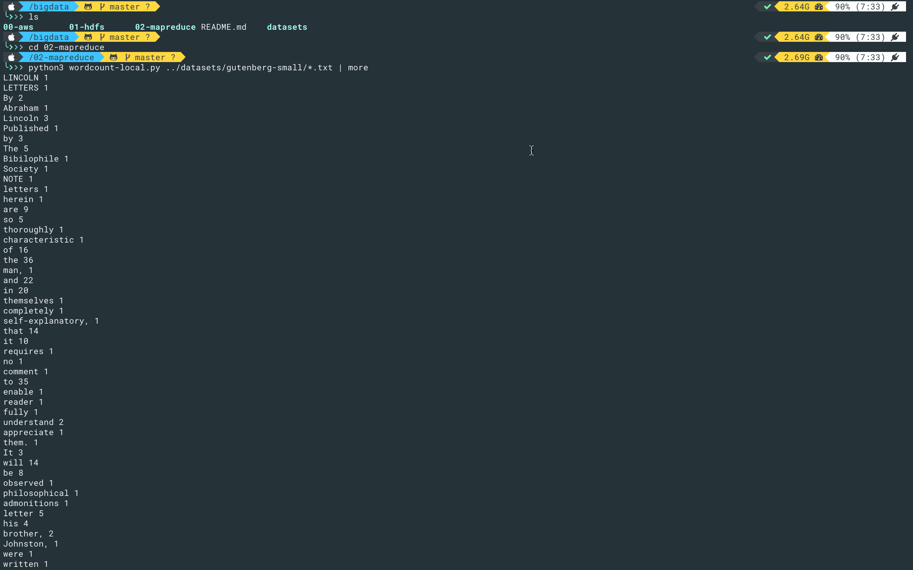

# Laboratorio 2 - MapReduce

## 1. WordCount - LOCAL

1. Ingresamos a la carpeta `02-mapreduce` dentro del repositorio [bigdata](https://github.com/st0263eafit/bigdata).
2. Corremos el `wordcount-local.py`  y después el `wordcount-mr.py` en modo local. 

## 2. WordCount - HADOOP

1. Ingresamos a [jupter116.dis.eafit.edu.co](https://jupyter116.dis.eafit.edu.co/hub/login) y nos logeamos.
2. Una vez adentro iremos a la terminal para ingresar a la máquina.  
3. Corremos el `wordcount-mrjob.py` de forma local.  

## 3. WordCount - EMR

1. Ingresamos al cluster de EMR utilizando `ssh`. 
2. Instalamos `git` usando `yum install git -y` y clonamos el respositorio [bigdata](https://github.com/st0263eafit/bigdata) como se ve en la imagen. 
3. Instalamos `mrjob` con el comando `sudo pip-3.6 install mrjob` después seguimos los pasos como en la imagen para correr el `wordcount-mrjob.py`. Finalmente obtenemos el siguiente resultado. 

## 4. Ejercicio Seleccionado

Se escogió el ejercicio 1 y se obtuvo el siguiente resultado  el código se encuentra en [empleados.py](empleados.py).
