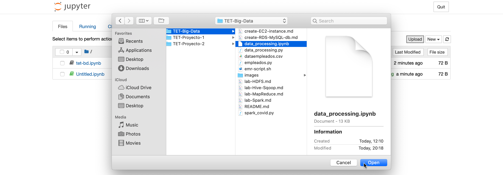

# Laboratorio Spark

## 1. Notebook Data Processing

Estos fueron los pasos seguidos y resultados que se obtuvieron el ejecutar el Jupyter Notebook proveído. Éste se encuentra en [data_processing.ipynb](data_processing.ipynb) con las variables correspondientes del bucket de S3.

1. Teniendo un cluster EMR en estado _Waiting_ creamos un Notebook.    
2. Subimos el `.ipynb` con el que trabajaremos.  
3. Seleccionamos el kernel _PySpark_. 
4. Ejecutamos el código.         

## 2. Notebook COVID-19 Colombia

Se obtuvieron los resultados que se observan a continuación al correr el Jupyter Notebook [pyspark_covid.ipynb](pyspark_covid.ipynb). Lastimosamente parquet no funcionó puesto que la base de datos en formato csv realizada por el gobierno colombiano es pauperrima.

1. Creamos un nuevo `.ipynb` dando click al lado del _Upload_ que se observa en el punto 2 del numeral 1.
2. Se desarrolla el taller y se ejecuta. El texto que se encuentra en rojo es debido una de las tantas inconsistencias y errores en la estructura que tiene el dataset que provee el estado colombiano.     
